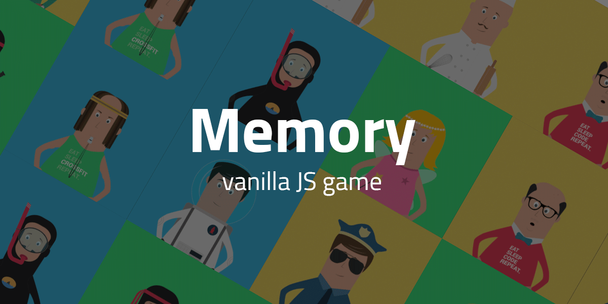

# Examination JS Memory
**Webbutveckling 2**

## Memory, så spelar man
Framför dig ligger en spelplan med 24 bilder upplagt med enhetlig baksida upp. På spelplanen finns det alltid två bilder med samma motiv.

Börja memoryt med att vända ett kort. Försök sedan hitta ett annat kort som har samma bild som det första. Om du inte hittar ett par vänds korten tillbaka med baksidan upp.

Försök komma ihåg dessa bilder så blir det lättare att hitta paren ju längre du spelar. När du hittar ett par tas dessa bort ( alt. markeras på någåt sätt ) och när du hittat alla par i detta memory har du vunnit spelet.

Utmaningen blir att hitta samtliga par på minsta möjliga antal försök. 


## Assets
Till din hjälp har du mappen ```src``` som innehåller en *html*, *.scss* samt 12 bilder. Egna bilder går också bra, men prioritera inte detta.


## Bedömning
|Aspekt|E|C|A|
|---|---|---|---|
|I arbetet utvecklar eleven kod som med ____ resultat följer standarder och som omfattar ____ teknik för märkspråk och stilmallar där eleven ____ använder tekniker för att generera stilmallskod. | tillfredsställande / någon / i begränsad utsträckning | tillfredsställande / några / - | gott / flera / i omfattande utsträckning |
| Eleven utvecklar med ____ funktionalitet inom [...] domskript. | tillfredsställande / någon enkel funktion | tillfredsställande / några funktioner | gott / flera funktioner av komplex natur |
|Produkten är av ____ kvalitet när det gäller funktion vilket eleven kontrollerar med hjälp av _____ test. | tillfredsställande / något | tillfredsställande / några | god / flera tester |


## Inlämning
Ditt projekt lämnas in via länk till *forkat* repo i classroom senast **måndag 7/2  kl 17.00**. Lektioner fram tills dess är det handledning.